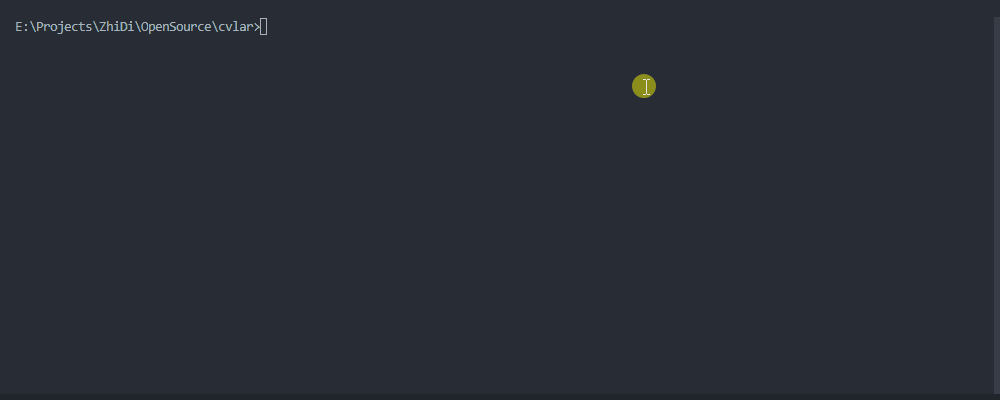

<div align="center">


# @kwooshung/cvlar


[](https://www.npmjs.com/package/@kwooshung/cvlar)
[](https://www.npmjs.com/package/@kwooshung/cvlar)
[](https://github.com/kwooshung/cvlar/actions/)
[](https://codecov.io/gh/kwooshung/cvlar)
[](https://codeclimate.com/github/kwooshung/cvlar/maintainability/)
[](LICENSE)
[](https://gitee.com/kwooshung/cvlar/)


<p align="center">
    <a href="README.md" style="font-weight:700;color:#165dff;text-decoration:underline;">English</a> | 
    <a href="README.zh-CN.md">中文</a>
</p>
</div>

# Why Develop It?

Before Cvlar, for an open-source project, I had to use the following packages to achieve git commit standardization, version management, and automatic changelog generation. Additionally, I utilized my own project [standard-version-helper](https://github.com/kwooshung/standard-version-helper) for interactive console-based version upgrades. Naturally, there was no feature for automatic version publishing in Github Actions. With Cvlar, you only need to optionally retain `commitlint` to access all previously mentioned functionalities and more.

- ~~commitizen~~
- **commitlint**
- ~~commitlint-config-cz~~
- ~~commitlint-config-git-commit-emoji~~
- ~~conventional-changelog~~
- ~~conventional-changelog-cli~~
- ~~cz-conventional-changelog~~
- ~~cz-customizable~~
- ~~standard-version~~
- ~~@kwooshung/standard-version-helper~~

# Why Name It Cvlar?

- C: `commit`
- V: `version`
- L: `changelog`
- R: `release`

> Although named Cvlar, its features are not limited to these.

# Features at a Glance

- **Easy to Remember**: Simply use the `cvlar` command, or `cvlar -h/help` for help;
- **Effortless Script Selection and Execution**: from `package.json`'s `scripts`;
- **Package Management**:
  - Easily choose between `npm`, `yarn`, `pnpm`, or other package managers for automatic installation;
  - Configurable sources without affecting existing settings;
- **Git Commit**:
  - Smooth selection of 'commit types' and 'commit scopes';
  - Input for 'short descriptions', 'long descriptions', 'closing issues', custom 'fields', 'commit message' validation, and auto 'push to repository';
  - Support for auto-translating `commit messages` into specified languages via Google Translate, especially useful for non-English speakers;
- **Version Management**:
  - Easily 'upgrade version numbers', choose 'major', 'minor', 'patch', or 'preview versions', with 'preview versions' automatically iterating, e.g., `v1.0.0-preview.1`, `v1.0.0-preview.2`;
  - Specify 'version upgrades' or 'downgrades';
  - Auto-generate 'changelogs' and 'push to repository';
- **Log Management**: Easy 'template' setup, auto-generate `changelogs` from `git messages`, with Google Translate support for **multiple languages**, and auto 'push to repository';
- **Automatic Publishing**:
  - In `Github Actions`, using `cvlar -r` will analyze the `log` file and automatically publish it to the repository's release page.
  - See: [This repository's releases page](https://github.com/kwooshung/cvlar/releases);
- **Simple Configuration**:
  - Initiate with `cvlar -i/init` for interactive configuration file creation;
  - Multilingual interactive menu during initialization; subsequent use supports any language, configurable in `cvlar`'s file;
  - Config file supports `js`, `cjs`, and `mjs`;
    - To configure `commit types` and `commit scopes` once;
    - Discovered that `commitlint` does not recognize `mjs`, hence only `cjs` and `js` configuration formats are currently supported.
  - See:
    - [This repository's commit types configuration](https://github.com/kwooshung/cvlar/blob/main/scripts/ks-cvlar.types.cjs)
    - [This repository's commit scopes configuration](https://github.com/kwooshung/cvlar/blob/main/scripts/ks-cvlar.scopes.cjs)
    - [This repository's cvlar config](https://github.com/kwooshung/cvlar/blob/main/.ks-cvlarrc.cjs);
- Customizable menu languages through configuration
- Boosts work efficiency
- User-friendly for beginners

# Installation

## npm

```bash
npm install standard-version @kwooshung/cvlar --save-dev
```

## yarn

```bash
yarn add standard-version @kwooshung/cvlar -D
```

## pnpm

```bash
pnpm add standard-version @kwooshung/cvlar -D
```

# How to Use

## View Help with `cvlar -[h, help]`


## Initialize with `cvlar -[i, init]`



After initialization, the `.ks-cvlarrc.cjs` configuration file can be placed anywhere. The screenshot above doesn't show the option to specify a save path because it detected an existing configuration file.

- [This repository's commit types configuration](https://github.com/kwooshung/cvlar/blob/main/scripts/ks-cvlar.types.cjs)
- [This repository's commit scopes configuration](https://github.com/kwooshung/cvlar/blob/main/scripts/ks-cvlar.scopes.cjs)
- [This repository's cvlar config](https://github.com/kwooshung/cvlar/blob/main/.ks-cvlarrc.cjs);

## Main Menu `cvlar`


## Important Notice

> The following images demonstrate the interface using Chinese GIFs for illustration. However, in practice, this menu can be in any language, customizable through the `cvlar` configuration file.
> Due to the complexities of recording, English version demonstrations are currently unavailable but will be supplemented when possible.
> Additionally, English static image screenshots are provided below the titles for reference, if necessary.

## Run `package.json script`


## Git Commit

### Run Commit Files


### Run Upgrade Version


## Package Management

### Install Dependencies


### Uninstall Dependencies


### Update Dependencies


### List Outdated Packages


### View Dependency List


### View Package Details


### Search for Packages


## Log Management

Here, **Regenerate Logs** is used as a demonstration, as it consists of two steps: **Clear Logs** and **Generate Logs**.


## Automatic Publishing

### References

- [This repository's releases page](https://github.com/kwooshung/cvlar/releases);
- [This repository's Github Actions](https://github.com/kwooshung/cvlar/.github/workflows/ci.yml);

### Script Reference

```yml
- name: Auto Release
  run: cvlar -r
  env:
    GITHUB_TOKEN: ${{ secrets.GITHUB_TOKEN }}
```

# Configuration

## Default Search Paths and Files

The commented `.mjs` files, as previously mentioned, are not recognized by `commitlint`. Therefore, only `cjs` and `js` format configurations are currently supported.

```javascript
[
  '/ks-cvlar.js',
  '/ks-cvlar.conf.js',
  '/ks-cvlar.config.js',
  //'/ks-cvlar.mjs',
  //'/ks-cvlar.conf.mjs',
  //'/ks-cvlar.config.mjs',
  '/ks-cvlar.cjs',
  '/ks-cvlar.conf.cjs',
  '/ks-cvlar.config.cjs',
  '/ks-cvlarrc.js',
  '/ks-cvlarrc.conf.js',
  '/ks-cvlarrc.config.js',
  //'/ks-cvlarrc.mjs',
  //'/ks-cvlarrc.conf.mjs',
  //'/ks-cvlarrc.config.mjs',
  '/ks-cvlarrc.cjs',
  '/ks-cvlarrc.conf.cjs',
  '/ks-cvlarrc.config.cjs',
  'ks-cvlar.js',
  'ks-cvlar.conf.js',
  'ks-cvlar.config.js',
  //'ks-cvlar.mjs',
  //'ks-cvlar.conf.mjs',
  //'ks-cvlar.config.mjs',
  'ks-cvlar.cjs',
  'ks-cvlar.conf.cjs',
  'ks-cvlar.config.cjs',
  'ks-cvlarrc.js',
  'ks-cvlarrc.conf.js',
  'ks-cvlarrc.config.js',
  //'ks-cvlarrc.mjs',
  //'ks-cvlarrc.conf.mjs',
  //'ks-cvlarrc.config.mjs',
  'ks-cvlarrc.cjs',
  'ks-cvlarrc.conf.cjs',
  'ks-cvlarrc.config.cjs',
  '.ks-cvlar.js',
  '.ks-cvlar.conf.js',
  '.ks-cvlar.config.js',
  //'.ks-cvlar.mjs',
  //'.ks-cvlar.conf.mjs',
  //'.ks-cvlar.config.mjs',
  '.ks-cvlar.cjs',
  '.ks-cvlar.conf.cjs',
  '.ks-cvlar.config.cjs',
  '.ks-cvlarrc.js',
  '.ks-cvlarrc.conf.js',
  '.ks-cvlarrc.config.js',
  //'.ks-cvlarrc.mjs',
  //'.ks-cvlarrc.conf.mjs',
  //'.ks-cvlarrc.config.mjs',
  '.ks-cvlarrc.cjs',
  '.ks-cvlarrc.conf.cjs',
  '.ks-cvlarrc.config.cjs',
  'config/ks-cvlar.js',
  'config/ks-cvlar.conf.js',
  'config/ks-cvlar.config.js',
  //'config/ks-cvlar.mjs',
  //'config/ks-cvlar.conf.mjs',
  //'config/ks-cvlar.config.mjs',
  'config/ks-cvlar.cjs',
  'config/ks-cvlar.conf.cjs',
  'config/ks-cvlar.config.cjs',
  'config/ks-cvlarrc.js',
  'config/ks-cvlarrc.conf.js',
  'config/ks-cvlarrc.config.js',
  //'config/ks-cvlarrc.mjs',
  //'config/ks-cvlarrc.conf.mjs',
  //'config/ks-cvlarrc.config.mjs',
  'config/ks-cvlarrc.cjs',
  'config/ks-cvlarrc.conf.cjs',
  'config/ks-cvlarrc.config.cjs',
  '.config/ks-cvlar.js',
  '.config/ks-cvlar.conf.js',
  '.config/ks-cvlar.config.js',
  //'.config/ks-cvlar.mjs',
  //'.config/ks-cvlar.conf.mjs',
  //'.config/ks-cvlar.config.mjs',
  '.config/ks-cvlar.cjs',
  '.config/ks-cvlar.conf.cjs',
  '.config/ks-cvlar.config.cjs',
  '.config/ks-cvlarrc.js',
  '.config/ks-cvlarrc.conf.js',
  '.config/ks-cvlarrc.config.js',
  //'.config/ks-cvlarrc.mjs',
  //'.config/ks-cvlarrc.conf.mjs',
  //'.config/ks-cvlarrc.config.mjs',
  '.config/ks-cvlarrc.cjs',
  '.config/ks-cvlarrc.conf.cjs',
  '.config/ks-cvlarrc.config.cjs'
];
```

## Specifying the Configuration File

If you wish to store the configuration file in a different location, use the following command to specify the directory. This makes `cvlar` prioritize the directory specified by `-[cd/config-dir]`.

> Note: Specify the folder path, not the file path!

```
cvlar -[cd/config-dir] xxx/xx/x
```

It's recommended to set this in the `scripts` section of `package.json`:

```json
{
  "scripts": {
    "cvlar": "cvlar -cd xxx/xx/x"
  }
}
```

## Configuration File Description and Reference

Generate the corresponding configuration file using `cvlar -i/init`, as described in the **Initialization** section above;
The following two files are configuration files generated by this command, representing configurations in **Chinese** and **English** respectively;

- [.ks-cvlarrc.cjs](https://github.com/kwooshung/cvlar/blob/main/.ks-cvlarrc.cjs)
- [.ks-cvlarrc.en.cjs](https://github.com/kwooshung/cvlar/blob/main/.ks-cvlarrc.en.cjs)

# Other

## Commitlint Configuration

The file [commitlint.cjs](https://github.com/kwooshung/cvlar/blob/main/commitlint.cjs) is a configuration file for `commitlint`. It is designed for setting up `commitlint`. To simplify unified management, two separate files, `ks-cvlar.types.cjs` and `ks-cvlar.scopes.cjs`, are created. They are used for configuring the `types` and `scopes` in `commitlint` and also for configuring the `commit` menu in `cvlar`.

- [This repository's commit types configuration](https://github.com/kwooshung/cvlar/blob/main/scripts/ks-cvlar.types.cjs)
- [This repository's commit scopes configuration](https://github.com/kwooshung/cvlar/blob/main/scripts/ks-cvlar.scopes.cjs)

In [commitlint.cjs](https://github.com/kwooshung/cvlar/blob/main/commitlint.cjs), you can import the `ks-cvlar.types.cjs` and `ks-cvlar.scopes.cjs` files. However, since the `commit` configuration in `cvlar` differs from that in `commitlint`, you need to import two functions like this:

```javascript
const { ConvertToLintTypes, ConvertToLintScopes } = require('@kwooshung/cvlar');
```

This facilitates conversion to commitlint configuration. For detailed usage, please refer to [commitlint.cjs](https://github.com/kwooshung/cvlar/blob/main/commitlint.cjs).

### When Translating Commit Messages with Commitlint Enabled

If the translation feature for `commit message` is enabled and the standard short description length is 72 characters, it's not advisable to set `commitlint`'s `header-max-length` rule to 72 characters as well. Translated commit messages may exceed 72 characters, causing `commitlint` errors. There are three recommended settings for `commitlint`'s `header-max-length` rule:

#### Option 1 (Recommended): Set `commitlint`'s `header-max-length` to `double` or more of the normal character limit, such as `200`

```javascript
module.exports = {
  extends: ['@commitlint/config-conventional'],
  rules: {
    'header-max-length': [2, 'always', 200]
  }
};
```

#### Option 2: Disable `commitlint`'s `header-max-length` rule, but future implications are uncertain

```javascript
module.exports = {
  extends: ['@commitlint/config-conventional'],
  rules: {
    // 'header-max-length': [0, 'always', 72]
  }
};
```

#### Option 3: Set `commitlint`'s `header-max-length` as follows

```javascript
module.exports = {
  extends: ['@commitlint/config-conventional'],
  rules: {
    'header-max-length': [0, 'always']
  }
};
```

## Development & Maintenance

- This project was primarily developed to accelerate development processes. Given the limited daily development time and tight schedules, some unforeseen `issues` may arise. Your valuable opinions and suggestions are most welcome. Please submit them in a friendly and kind manner!
- Recently, due to a hectic work schedule, responses to `issues` and `pull requests (pr)` might be slower than usual. Your understanding is greatly appreciated. However, I still encourage everyone to actively submit `issues` and `pr`. As time permits, they will be addressed collectively!
- Given my time constraints, I highly recommend submitting `pull requests (pr)` as it facilitates faster resolution of `issues`!
